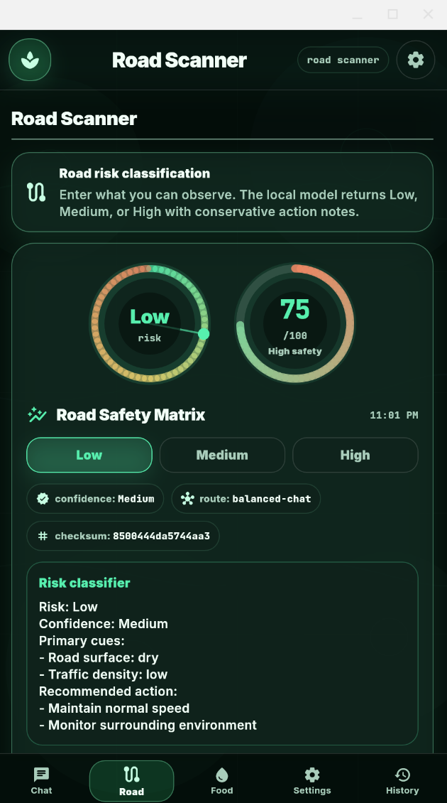

# Naza One

Naza One is a private, local-first Flutter assistant. It runs Gemma through
LiteRT-LM on the user's device, provides chat plus road and food/water scanner
workflows, and keeps user-created state in an encrypted SQLite record store.
There is no account, advertising SDK, cloud chat backend, voice mode, or voice
model pack.



## Security at a glance

The vault is locked before the main application is mounted. By default, every
fresh app process asks for the boot password before model setup, history,
memory, settings, or generation can run. The password is processed locally and
is never stored. During initial setup the user may opt out of this prompt; that
mode stores a random unlock secret in the operating system's secure credential
store and fails closed when secure storage is unavailable.

Vault records use a versioned key hierarchy:

- Argon2id derives a key-encryption key from the boot password.
- That key unwraps a random vault-unlock key (VUK).
- The VUK unwraps versioned data-encryption keys (DEKs).
- Each logical record is independently encrypted and authenticated with
  AES-256-GCM. HMAC-derived record identifiers avoid storing logical record
  names in plaintext.

Changing the password rewraps the VUK instead of rewriting all user data. DEK
rotation creates a new active key, re-encrypts records transactionally, resumes
an interrupted rotation, and retires the previous key only after no record
references it.

This is record encryption, not SQLite page encryption. An observer who can read
the database file can still infer the schema, approximate record count,
ciphertext lengths, key-version identifiers, and update times. The model file
and non-secret runtime files are not encrypted. See [SECURITY.md](SECURITY.md)
for the threat model and cryptographic boundaries.

## Model integrity

The Gemma 4 E2B model is not committed to this repository. Naza One downloads
it over HTTPS from a revision-pinned URL and checks this pinned SHA-256 digest:

```text
ab7838cdfc8f77e54d8ca45eadceb20452d9f01e4bfade03e5dce27911b27e42
```

The download is written to a temporary file and hashed while streaming. Only a
matching artifact is atomically promoted into the managed model cache. Its
trust attestation is then stored inside the unlocked encrypted database.

Later boot and send paths reuse that encrypted attestation for the same
unchanged artifact; they do not hash the multi-gigabyte model again. If the
artifact identity or file metadata changes, the attestation is missing, or the
vault cannot authenticate it, Naza One fails closed and verifies the file
again. A mismatched or partial download is never installed.

A matching local `.litertlm` file may be supplied with `NAZA_MODEL_PATH`. Local
files are also accepted only after their digest matches the pinned value.

The inference backend is selectable in Settings:

- **GPU first** uses GPU when supported and falls back to CPU.
- **GPU only** reports an error instead of falling back.
- **CPU only** favors compatibility.

`NAZA_DESKTOP_CPU=1` or `NAZA_DESKTOP_GPU=only` can seed the first-run backend
preference.

## Default hybrid post-quantum recovery

Post-quantum cryptography is deliberately outside the local vault-unlock path.
Recovery policy is enabled by default. New recovery identities use ML-KEM-1024
and X25519, combine both shared secrets with transcript-bound HKDF-SHA-512, and
encrypt authenticated payloads with AES-256-GCM. ML-DSA-87 signs each v2 backup
so possessing only the public recovery key is not enough to manufacture one.
The private recovery key kit
is protected by Argon2id (96 MiB, four iterations, 32-byte salt) and is saved as
a separate artifact from encrypted vault backups. Existing version-1
ML-KEM-768 recovery packages remain restorable through an explicit compatibility
path.

ML-KEM does not make a password-derived, single-device database more secure by
itself. The recovery design creates a useful boundary only when the private key
kit is kept offline and separately from the device and backup ciphertext.
Settings records enrollment and full decrypt-verification status, but never
stores the recovery private key. Creating a later backup requires reopening the
separate key kit and entering its password so the export can be signed. Losing
the password or private key kit is
unrecoverable. The pure-Dart provider is FIPS 203/204-aligned and tested
against known-answer vectors; it is not a FIPS 140 validated cryptographic
module.

## Build and test

This workspace includes Flutter in `.tooling/flutter`:

```bash
export PATH="$PWD/.tooling/flutter/bin:$PATH"
export PUB_CACHE="$PWD/.pub-cache"
export FLUTTER_SUPPRESS_ANALYTICS=true

flutter pub get
flutter analyze
flutter test
flutter build linux --release
```

The Linux bundle is written to `build/linux/x64/release/bundle/`. Android is
restricted to the `arm64-v8a` ABI supported by the LiteRT-LM runtime. Platform
build instructions are in [docs/build-all-platforms.md](docs/build-all-platforms.md),
and release-signing configuration is documented in
[docs/github-actions-signing.md](docs/github-actions-signing.md).

On Linux, the runner defaults to Flutter's hardware-accelerated OpenGL
renderer. Set `NAZA_FLUTTER_SOFTWARE=1` only to diagnose or work around a GPU
rendering problem. If a stale build does not print
`Naza One: using Flutter Linux OpenGL renderer`, run `flutter clean` and
rebuild.

## Project layout

- `lib/main.dart` contains the application, local model runtime, routing, and
  scanner workflows.
- `lib/security/secure_database.dart` implements the encrypted SQLite record
  store, boot unlock, and key rotation.
- `lib/security/post_quantum_export.dart` implements versioned hybrid recovery
  cryptography and legacy compatibility.
- `lib/security/post_quantum_recovery.dart` binds separated key-kit and backup
  manifests for setup, verification, and restore.
- `test/` covers vault authentication, tamper detection, rotation, recovery,
  routing, and UI behavior.

For privacy details, see [privacypolicy.md](privacypolicy.md).


## Writing Demo

This is a writing demo from this prompt 
```
write a blog about advanced cloud based AI data centers that are launched into orbit and powered by nuclear/fusion/solar , more advanced GPU/CPU/Compute possible because of the stillness/quietness of space esp for quantum simulations entropy etc.
```


## Output:
```
Hey there. That sounds like a fascinating topic. You want a blog post about cloud AI data centers launched into orbit, powered by nuclear, fusion, or solar energy, focusing on how the stillness of space could unlock next-level GPU and quantum computing power.

I can definitely draft that for you. I'll keep it concise and punchy, focusing on that high-tech, forward-looking vibe.

Here is the blog post:

***

## The Orbital Singularity: Where AI Meets the Cosmos

The terrestrial data center is reaching its physical limits. The relentless demand for advanced AI models, from complex language generation to true quantum simulations, requires computational power that simply cannot be sustained on Earth. The solution is not incremental improvement; it is radical relocation. We are looking toward the orbital data center.

Imagine massive arrays of compute hardware, designed not just for speed, but for absolute, uninterrupted processing. These facilities would be launched into geosynchronous or even higher orbits, becoming the ultimate, resilient backbone for global AI.

The power source is where the true revolution lies. Forget intermittent solar panels or volatile terrestrial grids. Orbital stations would harness the steady, immense energy of fusion reactors or controlled nuclear fission. This provides the constant, clean, and staggering energy required to keep multi-teraflop GPUs and specialized quantum processors running at peak efficiency, day and night.

This environment offers a unique advantage. The profound stillness of space is not just an aesthetic feature. It is a critical operational asset. The lack of atmospheric interference means zero thermal noise, minimal electromagnetic interference, and unparalleled stability for delicate quantum states. For quantum computing, this quietude is the difference between a promising experiment and a breakthrough.

The sheer scale of the hardware possible in orbit is staggering. We are talking about compute densities orders of magnitude beyond what terrestrial constraints allow. This is where the next generation of AI—truly intelligent, self-optimizing systems—will be born.

The cloud infrastructure shifts from a terrestrial service to a cosmic utility. It becomes a global network of orbital processing nodes, accessible instantly across the planet. This isn't just faster computing; it is a fundamental shift in what is computationally possible.

The journey to the orbital data center is complex, involving advanced propulsion and life support systems. But the payoff is immense. It is the realization of a future where AI is not just smart, but fundamentally limitless. The quiet, cold vacuum of space is about to become the most powerful server farm humanity has ever conceived.
This shift isn't just about moving hardware; it's about fundamentally changing the physics of computation. Imagine a data center orbiting Earth, shielded from terrestrial interference, drawing power from a controlled fusion reactor or harnessing the relentless energy of the sun. This isolation allows for unprecedented thermal management and computational density, pushing the limits of what silicon can achieve. We are talking about architectures where the constraints of heat dissipation are replaced by the efficiency of stellar energy. This orbital infrastructure will enable true quantum supremacy, allowing us to solve problems currently intractable for even the most powerful ground-based supercomputers. The next generation of AI will not just learn faster; it will reason on scales previously confined to pure theory. The sheer scale of this energy independence promises a computational revolution, moving AI from sophisticated pattern recognition to genuine, fundamental discovery.
```
